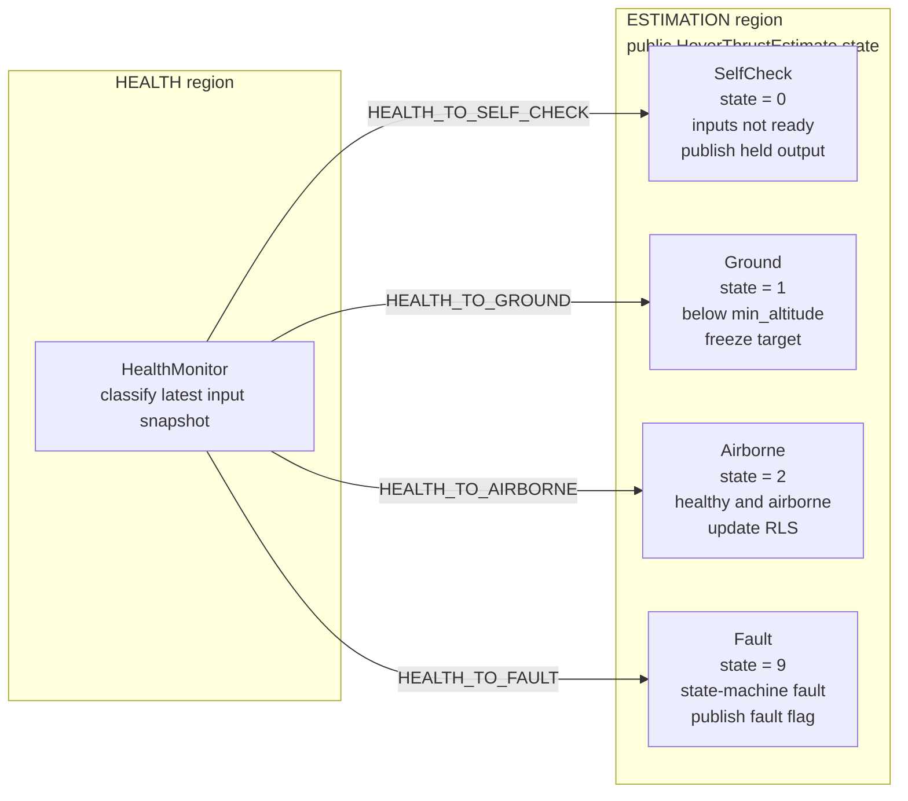
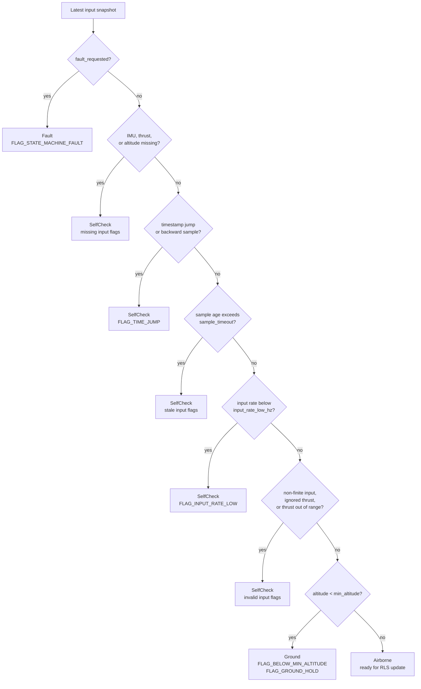
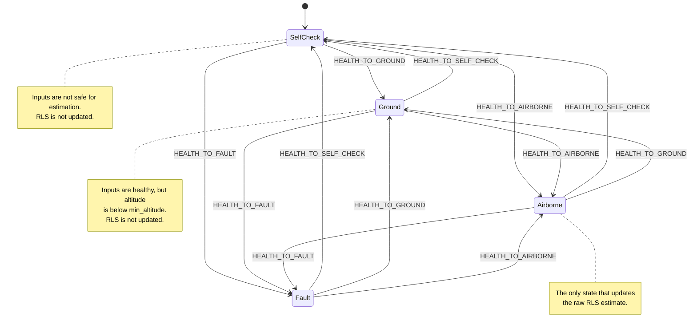
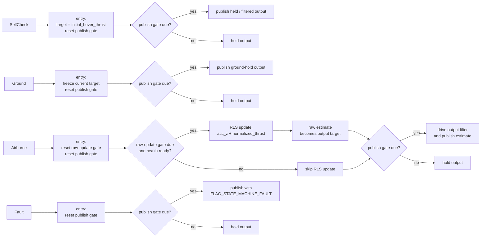

# Hover Thrust Estimator

ROS1 package for estimating the normalized hover thrust used by PX4/MAVROS
multirotor controllers.

The estimator subscribes to MAVROS IMU, target attitude thrust, and local pose
topics. It publishes a latched `hover_thrust_estimator/HoverThrustEstimate`
message containing the current estimator state, health flags, and filtered
hover thrust estimate.

## State Model

The runtime state machine has two regions:

- `HEALTH`: one internal state, `HealthMonitor`, that continuously classifies
  the latest inputs.
- `ESTIMATION`: four externally visible estimator states.

Only the four estimation states are exported in `HoverThrustEstimate.state`.



The internal state ids are different from the message values:

| Internal state | Internal id |
| --- | ---: |
| `HealthMonitor` | `1` |
| `SelfCheck` | `10` |
| `Ground` | `11` |
| `Airborne` | `12` |
| `Fault` | `19` |

## Health Classification

`HealthMonitor` maps the latest input snapshot to one of the four estimation
states. The first failing gate wins.



## Transition Rules

The estimation region follows the health target whenever the target differs
from the current state. All non-self transitions are explicit:



There are no explicit self-transitions. If the health target is already the
active estimation state, `HealthMonitor` does not post a transition event.

## State Actions

Each estimation state owns a small action path. Only `Airborne` can update the
raw RLS estimate; all states can publish an output snapshot when the publish
gate is due.



## Estimation Update

The raw estimator fits a scalar relation:

```text
imu_acc_z ~= thrust_to_acceleration * normalized_thrust
hover_thrust = gravity / thrust_to_acceleration
```

Raw RLS updates are only attempted in `Airborne` and only at
`raw_update_rate`. The published hover thrust is driven toward the latest raw
target through the output low-pass model when publishing is due.

## Topics and Parameters

Default topics:

| Direction | Topic | Type |
| --- | --- | --- |
| Subscribe | `mavros/imu/data` | `sensor_msgs/Imu` |
| Subscribe | `mavros/setpoint_raw/target_attitude` | `mavros_msgs/AttitudeTarget` |
| Subscribe | `mavros/local_position/pose` | `geometry_msgs/PoseStamped` |
| Publish | `hover_thrust/estimate_state` | `hover_thrust_estimator/HoverThrustEstimate` |

Important timing and gating parameters:

| Parameter | Default | Purpose |
| --- | ---: | --- |
| `sample_timeout` | `0.2` | Maximum sample age before stale flags are set. |
| `input_rate_low_hz` | `5.0` | Minimum healthy input stream rate. |
| `min_altitude` | `0.5` | Altitude threshold below which the estimator enters `Ground`. |
| `loop_rate` | `1000.0` | Main runtime update loop rate. |
| `publish_rate` | `100.0` | Estimate-state publish rate. |
| `raw_update_rate` | `10.0` | RLS raw-estimate update rate. |
