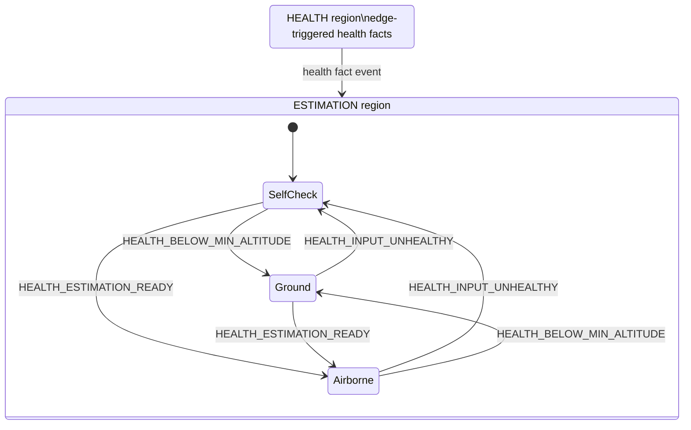
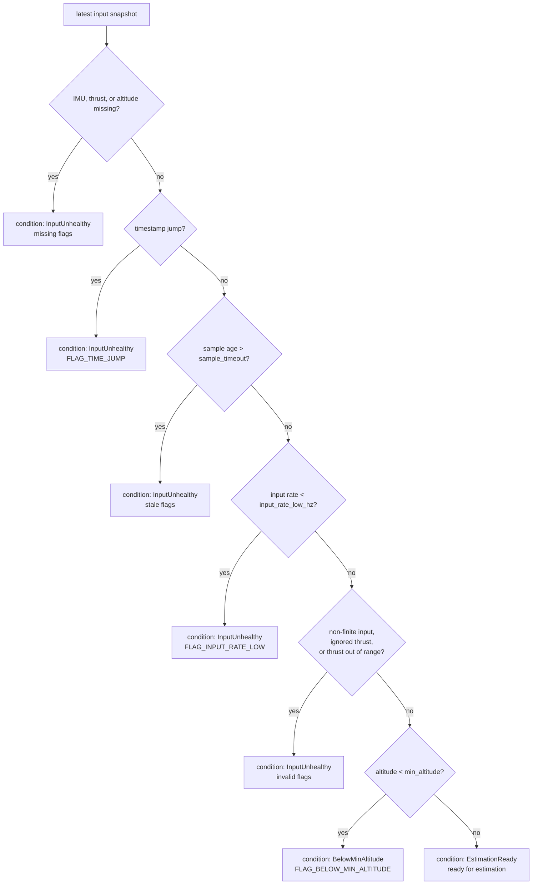

# Hover Thrust Estimator

ROS1 packages for estimating normalized hover thrust for PX4/MAVROS multirotor
controllers. `hover_thrust_estimator_msgs` owns the public message interface;
`hover_thrust_estimator` owns the estimator implementation.

This README focuses on the runtime state model, transition conditions, state
actions, estimator math, and ROS interface.

## State Machine Model

The runtime has two state-machine regions:

- `HEALTH`: evaluates the latest input health condition and emits a health
  fact event only when that condition changes.
- `ESTIMATION`: owns the public estimator state published in
  `HoverThrustEstimate.state`.

The health event is an event id, not a destination object. It describes a fact
such as unhealthy input, below-minimum altitude, or estimation-ready input. The
active child state inside the `ESTIMATION` region consumes the fact according to
its configured outgoing transitions.

The public estimation states use these message values:

| State | Message value |
| --- | ---: |
| `SelfCheck` | `STATE_SELF_CHECK = 0` |
| `Ground` | `STATE_GROUND = 1` |
| `Airborne` | `STATE_AIRBORNE = 2` |

State-machine construction, transition, or update failures are not modeled as a
public estimator state. They are treated as runtime errors because the estimator
should not continue flying with an undefined state-machine update.

The transition table is:

| Current estimation state | `HEALTH_INPUT_UNHEALTHY` | `HEALTH_BELOW_MIN_ALTITUDE` | `HEALTH_ESTIMATION_READY` |
| --- | --- | --- | --- |
| `SelfCheck` | no transition | `Ground` | `Airborne` |
| `Ground` | `SelfCheck` | no transition | `Airborne` |
| `Airborne` | `SelfCheck` | `Ground` | no transition |

The "no transition" cells are not explicit self-transitions. In normal
operation the `HEALTH` region also does not re-emit the same condition; it only
posts a new fact event on a condition edge.

## Health Classification

The `HEALTH` region classifies the latest input snapshot in priority order. The
first matching condition determines the health condition and the flags published
with the output. Flags are updated on every evaluation, but a health event is
posted only when the condition changes.

Classification rules:

| Priority | Input fact | Health condition | Edge event | Main flags |
| ---: | --- | --- | --- | --- |
| 1 | IMU, thrust, or altitude has not been received. | `InputUnhealthy` | `HEALTH_INPUT_UNHEALTHY` | `FLAG_IMU_MISSING`, `FLAG_THRUST_MISSING`, `FLAG_ALTITUDE_MISSING` |
| 2 | Any sample timestamp jumps into the future or moves backward beyond tolerance. | `InputUnhealthy` | `HEALTH_INPUT_UNHEALTHY` | `FLAG_TIME_JUMP` |
| 3 | Any sample is older than `sample_timeout`. | `InputUnhealthy` | `HEALTH_INPUT_UNHEALTHY` | `FLAG_IMU_STALE`, `FLAG_THRUST_STALE`, `FLAG_ALTITUDE_STALE` |
| 4 | Any input stream rate is below `input_rate_low_hz`. | `InputUnhealthy` | `HEALTH_INPUT_UNHEALTHY` | `FLAG_INPUT_RATE_LOW` |
| 5 | IMU or altitude is non-finite; thrust is ignored, non-finite, `<= 1e-6`, or `> 1.0`. | `InputUnhealthy` | `HEALTH_INPUT_UNHEALTHY` | `FLAG_IMU_INVALID`, `FLAG_THRUST_INVALID`, `FLAG_ALTITUDE_INVALID` |
| 6 | Altitude is below `min_altitude`. | `BelowMinAltitude` | `HEALTH_BELOW_MIN_ALTITUDE` | `FLAG_BELOW_MIN_ALTITUDE` |
| 7 | All health checks pass. | `EstimationReady` | `HEALTH_ESTIMATION_READY` | none |

## State Actions

Each estimation state has entry, tick, and exit actions. Only `Airborne`
updates the raw recursive least-squares estimate.

| State | On entry | On tick | On exit |
| --- | --- | --- | --- |
| `SelfCheck` | Set output target to `initial_hover_thrust`; reset publish gate. | If the condition is `InputUnhealthy`, record `SelfCheck` output with health flags; publish if `publish_rate` gate is due; do not update RLS. | Reset publish gate. |
| `Ground` | Freeze current output target; reset publish gate. | If the condition is `BelowMinAltitude`, record `Ground` output with health flags; publish if `publish_rate` gate is due; do not update RLS. | Reset publish gate. |
| `Airborne` | Reset raw-update gate and publish gate. | If the condition is `EstimationReady`, update RLS when `raw_update_rate` gate is due; set raw estimate as the output target; publish if `publish_rate` gate is due. | Reset raw-update gate and publish gate. |

`Airborne` adds `FLAG_ESTIMATOR_REJECTED` if the RLS update rejects a sample.
It adds `FLAG_RAW_ESTIMATE_STALE` if the raw-update gate fires while the health
status is not ready.

## Estimation Math

The upstream controller/NMPC usually reasons in acceleration or specific force,
while PX4's attitude target interface expects a normalized collective thrust
command. This package provides the conversion scale between those two domains.

The model assumes that the PX4 normalized thrust command produces body-z
acceleration through a positive scalar gain:

$$
a_z^B \approx \theta(t) u
$$

where:

- $a_z^B$ is the measured IMU body-z acceleration used as the
  thrust-acceleration observation.
- $u$ is MAVROS/PX4 normalized thrust from `AttitudeTarget.thrust`.
- $\theta(t)$ is the normalized-thrust-to-acceleration gain.

The gain is treated as fixed or slowly time-varying over the estimator window.
This captures battery voltage drop, propeller efficiency changes, payload
changes, and other slow actuator-scale effects without modeling the full
multirotor dynamics.

The recursive least-squares estimator identifies $\theta$ from accepted sample
pairs:

$$
\left(u_k, a_{z,k}^B\right)
$$

when the state machine is `Airborne`, input health is `EstimationReady`, and the
`raw_update_rate` gate is due. The RLS forgetting factor is `rho2`.

At hover, the body-z thrust acceleration balances gravity:

$$
a_z^B \approx g
$$

so the normalized hover thrust is:

$$
u_h = \frac{g}{\theta}
$$

The downstream acceleration-to-thrust conversion can then use:

$$
u_{\mathrm{cmd}} \approx \frac{a_{z,\mathrm{cmd}}^B}{\theta}
                 = \frac{u_h}{g} a_{z,\mathrm{cmd}}^B
$$

where $a_{z,\mathrm{cmd}}^B$ must already be the desired body-z thrust
acceleration. If the controller produces a world-frame acceleration target, the
controller must first account for attitude and gravity projection before using
this one-dimensional gain.

The raw hover-thrust estimate is clamped to:

$$
u_h \in [u_{\min}, u_{\max}]
$$

The published estimate is optionally low-pass filtered by the output model when
publishing is due:

$$
\hat{u}_{h,\mathrm{pub}} = \mathrm{LPF}(u_{h,\mathrm{raw}}, f_c)
$$

where $f_c$ is `filter_cutoff_hz`.

This scalar model is intentionally simple. It does not explicitly model large
maneuver aerodynamics, motor/propeller nonlinearities, thrust saturation,
allocation limits, attitude-dependent gravity projection, IMU bias, or timestamp
misalignment between the IMU and thrust command. Those effects appear as model
error or rejected samples rather than separate states.

## Topics and Parameters

Default topics:

| Direction | Topic | Type | Used field |
| --- | --- | --- | --- |
| Subscribe | `mavros/imu/data` | `sensor_msgs/Imu` | `linear_acceleration.z` |
| Subscribe | `mavros/setpoint_raw/target_attitude` | `mavros_msgs/AttitudeTarget` | `thrust`, `type_mask` |
| Subscribe | `mavros/local_position/pose` | `geometry_msgs/PoseStamped` | `pose.position.z` |
| Publish | `hover_thrust/estimate_state` | `hover_thrust_estimator_msgs/HoverThrustEstimate` | `state`, `flags`, `hover_thrust` |
| Publish | `hover_thrust/debug/state_machine_trace` | `state_machine_msgs/StateMachineTrace` | non-periodic internal event and transition trace |

The estimate topic is the regular runtime interface. The debug trace topic is
not periodic: it is emitted only when the current update contains an internal
health event, an internal event consumption, a committed transition, or a
deferred internal event. Stable input at the main loop rate does not create
debug trace messages.

Default parameters:

| Parameter | Default | Meaning |
| --- | ---: | --- |
| `gravity` | `9.8066` | Gravity used to convert thrust-to-acceleration gain into hover thrust. |
| `initial_hover_thrust` | `0.3` | Initial output target and RLS prior. |
| `rho2` | `0.998` | RLS forgetting factor. |
| `min_hover_thrust` | `0.15` | Lower clamp for hover thrust. |
| `max_hover_thrust` | `0.85` | Upper clamp for hover thrust. |
| `min_altitude` | `0.5` | Altitude gate below which the estimator enters `Ground`. |
| `sample_timeout` | `0.2` | Maximum allowed sample age before stale flags are set. |
| `loop_rate` | `1000.0` | Main runtime update loop rate. |
| `publish_rate` | `100.0` | Output publish rate. |
| `raw_update_rate` | `10.0` | RLS raw-estimate update rate. |
| `input_rate_low_hz` | `5.0` | Minimum healthy input stream rate. |
| `filter_enabled` | `true` | Enables output low-pass filtering. |
| `filter_cutoff_hz` | `5.0` | Output low-pass cutoff frequency. |
| `imu_topic` | `mavros/imu/data` | IMU input topic. |
| `target_attitude_topic` | `mavros/setpoint_raw/target_attitude` | MAVROS target attitude input topic. |
| `altitude_topic` | `mavros/local_position/pose` | Local altitude input topic. |
| `estimate_state_topic` | `hover_thrust/estimate_state` | Regular estimate output topic. |
| `debug_trace_topic` | `hover_thrust/debug/state_machine_trace` | Non-periodic state-machine debug trace topic. |
