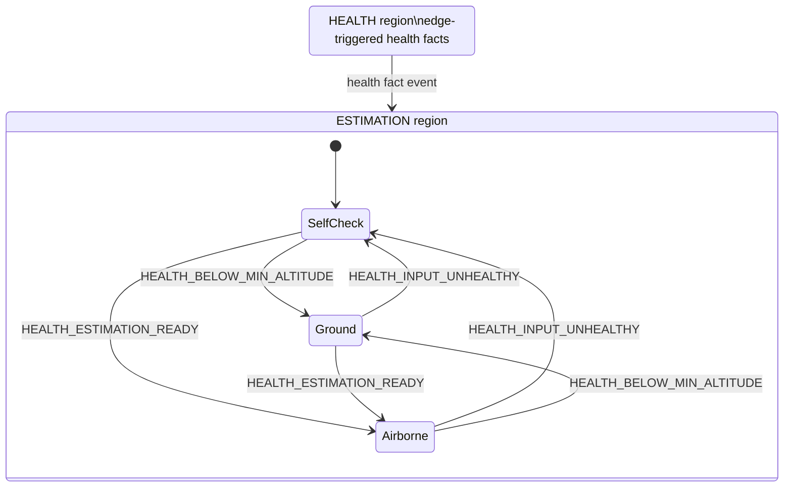
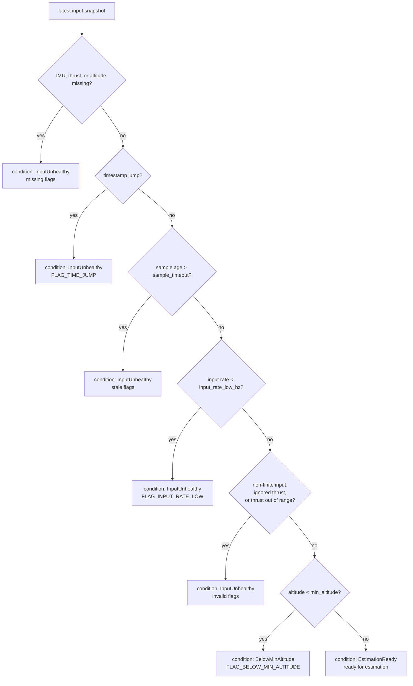

# Hover Thrust Estimator

## Shared runtime and transport facades

The domain owns one shared `hover_thrust_estimator_math` runtime library.
`ingestImu`, `ingestThrust` and `ingestAltitude` own sample periods, finite flags
and input events. Callers pass the source timestamp and explicit event clock,
then `update(now)` once after an input batch or on an idle tick. Only the
existing state-machine publication gates drive the output filter and capture
`publishedEstimates()`; transport consumers serialize those immutable records.
The ROS facade handles zero ROS header stamps at its edge. Core and native
never replace zero stamps with a hidden clock. Default initial thrust remains
0.3; the existing publish/raw gates, safety limits and estimator are unchanged.
Native drains preserve each input port's arrival FIFO and merge only queue
heads. A source clock regression is never globally sorted into a healthy
sequence. Shared ingestion retains a batch time-jump flag until an update has
observed it, so a later fresh sample cannot hide the fault. The existing 8192
time-jump flag and `ready=false` remain the original health outcome; tolerances
come from the unchanged sample-timing helper.

ROS and native facades link the same library; native ABI input `/1` retains
port 1 and optional `/2` uses port 4. The latter observes only normalized thrust
and `IGNORE_THRUST`, preserving the validated rate/attitude payload semantics.
No estimator source is built by the generic Host repository.

A ROS-free build is explicit:

```sh
cmake -S hover_thrust_estimator -B build-core -DBUILD_ROS=OFF \
  -DBUILD_NATIVE=ON -DCMAKE_PREFIX_PATH="$private_prefix" \
  -DCMAKE_INSTALL_PREFIX="$private_prefix"
cmake --build build-core -j1
(cd build-core && ctest --output-on-failure)
cmake --install build-core
```

The private prefix must contain the math/state-machine development packages and
`XgcRuntimeSDK`; native links `XgcRuntime::SDK`. For an explicit source SDK build,
set `XGC_RUNTIME_SDK_SOURCE_ROOT` to the generic runtime root instead. The SDK
owns its five canonical headers; no copied ABI header is kept here. Installed
core consumers use `find_package(HoverThrustEstimator CONFIG REQUIRED)` and
`HoverThrustEstimator::Runtime`.

The package candidate separates shared runtime (`libxgc2-hover-thrust-core0`),
headers/CMake target (`libxgc2-hover-thrust-dev`), native transport module
(`xgc2-hover-thrust-native`) and the existing ROS transport package. Both
facades require the exact same core package version. The header-only
`libxgc-runtime-sdk-dev` is a build prerequisite, not a runtime ELF dependency.
The historical `/opt/ros/noetic` install prefix is retained for compatibility;
using that directory does not introduce ROS dependencies into the core/native
ELFs. Local build/package evidence does not establish APT publication.

Core tests include the four existing state-gate regressions. The real ROS/native
facade test compares every shared publication field, actual ROS message fields,
zero-header fallback and idle stale-input ticks. The domain-owned seven-case
real Host regression is `hover_thrust_estimator/native/host_equivalence.rs`;
run `.xgc2/scripts/check_native_host.sh` with explicit `XGC_RUNTIME_SOURCE_ROOT`,
`HTE_NATIVE_LIBRARY`, `HTE_REFERENCE_BIN` and a private `HTE_HOST_WORK_DIR`.
That fixture consumes built domain artifacts and never falls back to compiling
an estimator from the generic runtime repository.


ROS1 packages for estimating normalized hover thrust for PX4/MAVROS multirotor
controllers. `hover_thrust_estimator_msgs` owns the public message interface;
`hover_thrust_estimator` owns the estimator implementation.

This README focuses on the runtime state model, transition conditions, state
actions, estimator math, and ROS interface.

## State Machine Model

The runtime has two state-machine regions:

- `HEALTH`: evaluates the latest input health condition and emits a health
  fact event only when that condition changes.
- `ESTIMATION`: owns the public estimator state published in
  `HoverThrustEstimate.state`.

The health event is an event id, not a destination object. It describes a fact
such as unhealthy input, below-minimum altitude, or estimation-ready input. The
active child state inside the `ESTIMATION` region consumes the fact according to
its configured outgoing transitions.

The public estimation states use these message values:

| State | Message value |
| --- | ---: |
| `SelfCheck` | `STATE_SELF_CHECK = 0` |
| `Ground` | `STATE_GROUND = 1` |
| `Airborne` | `STATE_AIRBORNE = 2` |

State-machine construction, transition, or update failures are not modeled as a
public estimator state. They are treated as runtime errors because the estimator
should not continue flying with an undefined state-machine update.


```mermaid
stateDiagram-v2
    state "HEALTH region\nedge-triggered health facts" as HEALTH

    state "ESTIMATION region" as ESTIMATION {
        state SelfCheck
        state Ground
        state Airborne

        [*] --> SelfCheck

        SelfCheck --> Ground: HEALTH_BELOW_MIN_ALTITUDE
        SelfCheck --> Airborne: HEALTH_ESTIMATION_READY

        Ground --> SelfCheck: HEALTH_INPUT_UNHEALTHY
        Ground --> Airborne: HEALTH_ESTIMATION_READY

        Airborne --> SelfCheck: HEALTH_INPUT_UNHEALTHY
        Airborne --> Ground: HEALTH_BELOW_MIN_ALTITUDE
    }

    HEALTH --> ESTIMATION: health fact event
```

The transition table is:

| Current estimation state | `HEALTH_INPUT_UNHEALTHY` | `HEALTH_BELOW_MIN_ALTITUDE` | `HEALTH_ESTIMATION_READY` |
| --- | --- | --- | --- |
| `SelfCheck` | no transition | `Ground` | `Airborne` |
| `Ground` | `SelfCheck` | no transition | `Airborne` |
| `Airborne` | `SelfCheck` | `Ground` | no transition |

The "no transition" cells are not explicit self-transitions. In normal
operation the `HEALTH` region also does not re-emit the same condition; it only
posts a new fact event on a condition edge.

## Health Classification

The `HEALTH` region classifies the latest input snapshot in priority order. The
first matching condition determines the health condition and the flags published
with the output. Flags are updated on every evaluation, but a health event is
posted only when the condition changes.


```mermaid
flowchart TD
    Start["latest input snapshot"] --> Missing{"IMU, thrust, or altitude missing?"}

    Missing -->|"yes"| MissingSelf["condition: InputUnhealthy<br/>missing flags"]
    Missing -->|"no"| TimeJump{"timestamp jump?"}

    TimeJump -->|"yes"| TimeSelf["condition: InputUnhealthy<br/>FLAG_TIME_JUMP"]
    TimeJump -->|"no"| Stale{"sample age > sample_timeout?"}

    Stale -->|"yes"| StaleSelf["condition: InputUnhealthy<br/>stale flags"]
    Stale -->|"no"| LowRate{"input rate < input_rate_low_hz?"}

    LowRate -->|"yes"| RateSelf["condition: InputUnhealthy<br/>FLAG_INPUT_RATE_LOW"]
    LowRate -->|"no"| Invalid{"non-finite input,<br/>ignored thrust,<br/>or thrust out of range?"}

    Invalid -->|"yes"| InvalidSelf["condition: InputUnhealthy<br/>invalid flags"]
    Invalid -->|"no"| LowAlt{"altitude < min_altitude?"}

    LowAlt -->|"yes"| ToGround["condition: BelowMinAltitude<br/>FLAG_BELOW_MIN_ALTITUDE"]
    LowAlt -->|"no"| ToAirborne["condition: EstimationReady<br/>ready for estimation"]
```

Classification rules:

| Priority | Input fact | Health condition | Edge event | Main flags |
| ---: | --- | --- | --- | --- |
| 1 | IMU, thrust, or altitude has not been received. | `InputUnhealthy` | `HEALTH_INPUT_UNHEALTHY` | `FLAG_IMU_MISSING`, `FLAG_THRUST_MISSING`, `FLAG_ALTITUDE_MISSING` |
| 2 | Any sample timestamp jumps into the future or moves backward beyond tolerance. | `InputUnhealthy` | `HEALTH_INPUT_UNHEALTHY` | `FLAG_TIME_JUMP` |
| 3 | Any sample is older than `sample_timeout`. | `InputUnhealthy` | `HEALTH_INPUT_UNHEALTHY` | `FLAG_IMU_STALE`, `FLAG_THRUST_STALE`, `FLAG_ALTITUDE_STALE` |
| 4 | Any input stream rate is below `input_rate_low_hz`. | `InputUnhealthy` | `HEALTH_INPUT_UNHEALTHY` | `FLAG_INPUT_RATE_LOW` |
| 5 | IMU or altitude is non-finite; thrust is ignored, non-finite, `<= 1e-6`, or `> 1.0`. | `InputUnhealthy` | `HEALTH_INPUT_UNHEALTHY` | `FLAG_IMU_INVALID`, `FLAG_THRUST_INVALID`, `FLAG_ALTITUDE_INVALID` |
| 6 | Altitude is below `min_altitude`. | `BelowMinAltitude` | `HEALTH_BELOW_MIN_ALTITUDE` | `FLAG_BELOW_MIN_ALTITUDE` |
| 7 | All health checks pass. | `EstimationReady` | `HEALTH_ESTIMATION_READY` | none |

## State Actions

Each estimation state has entry, tick, and exit actions. Only `Airborne`
updates the raw recursive least-squares estimate.

| State | On entry | On tick | On exit |
| --- | --- | --- | --- |
| `SelfCheck` | Set output target to `initial_hover_thrust`; reset publish gate. | If the condition is `InputUnhealthy`, record `SelfCheck` output with health flags; publish if `publish_rate` gate is due; do not update RLS. | Reset publish gate. |
| `Ground` | Freeze current output target; reset publish gate. | If the condition is `BelowMinAltitude`, record `Ground` output with health flags; publish if `publish_rate` gate is due; do not update RLS. | Reset publish gate. |
| `Airborne` | Reset raw-update gate and publish gate. | If the condition is `EstimationReady`, update RLS when `raw_update_rate` gate is due; set raw estimate as the output target; publish if `publish_rate` gate is due. | Reset raw-update gate and publish gate. |

`Airborne` adds `FLAG_ESTIMATOR_REJECTED` if the RLS update rejects a sample.
It adds `FLAG_RAW_ESTIMATE_STALE` if the raw-update gate fires while the health
status is not ready.

## Estimation Math

The estimator identifies the scale between PX4/MAVROS normalized collective
thrust and the body-z specific thrust seen by the vehicle. The controller can
then use that scale to convert an NMPC body-z thrust command into the normalized
thrust field expected by PX4.

The IMU observation used by this package is the direct z component of
`sensor_msgs/Imu.linear_acceleration` from `mavros/imu/data`:

$$
a_{z,\mathrm{imu}}^B = \mathrm{linear\_acceleration.z}
$$

It is treated as a body-frame accelerometer/specific-force observation, not as a
gravity-subtracted world-frame translational acceleration. For a level,
stationary or hovering vehicle this value is expected to be close to $+g$, not
zero. The estimator therefore does not add or subtract gravity from the IMU
sample.

The scalar thrust model is:

$$
a_{z,\mathrm{imu}}^B \approx f_z^B \approx \theta(t) u
$$

where $u$ is MAVROS/PX4 normalized collective thrust from
`AttitudeTarget.thrust`, $f_z^B$ is the actual body-z specific thrust
$(T/m)$, and $\theta(t)$ is the normalized-thrust-to-specific-thrust gain.
The MAVROS thrust field is not a physical thrust sensor; it is treated as the
commanded collective input, and the effective gain absorbs the command-to-actual
thrust relationship. Nonlinear thrust curves, PX4/mixer limits, motor dynamics,
and command-to-acceleration delay are not modeled as separate states.

The gain is treated as fixed or slowly time-varying over the estimator window.
This captures battery voltage drop, propeller efficiency changes, payload
changes, and other slow actuator-scale effects without modeling the full
multirotor dynamics.

The recursive least-squares estimator identifies $\theta$ from accepted sample
pairs:

$$
\left(u_k, a_{z,\mathrm{imu},k}^B\right)
$$

when the state machine is `Airborne`, input health is `EstimationReady`, and the
`raw_update_rate` gate is due. The RLS forgetting factor is `rho2`.

The published `hover_thrust` is not $\theta$. It is the level-hover normalized
thrust:

$$
u_h = \frac{g}{\theta}
$$

Here "level hover" means zero translational acceleration with the body z axis
aligned with the world vertical direction. Under that condition:

$$
f_z^B \approx a_{z,\mathrm{imu}}^B \approx g
$$

The controller-side normalization is only a unit conversion from body-z specific
thrust to PX4 normalized thrust:

$$
u_{\mathrm{cmd}} = \frac{f_{\mathrm{cmd}}^B}{\theta}
                 = \frac{u_h}{g} f_{\mathrm{cmd}}^B
$$

where $f_{\mathrm{cmd}}^B$ is the NMPC body-z specific thrust command
$(T_{\mathrm{cmd}}/m)$ in m/s^2. For example, if $u_h=0.2777$ and
$f_{\mathrm{cmd}}^B=10.0$ m/s^2:

$$
u_{\mathrm{cmd}} \approx 0.2777 \frac{10.0}{9.8066} \approx 0.283
$$

No attitude projection is applied in this normalization step. Attitude belongs
to the translational dynamics:

$$
a^W = R e_3 f^B - g e_3
$$

so multiplying by an additional tilt or gravity term here would double-count
modeling already handled by the NMPC.

The reference trajectory acceleration is a different signal. It must be the
world-frame net translational acceleration:

$$
a_{\mathrm{ref}}^W = \ddot{p}_{\mathrm{ref}}
$$

with gravity excluded. The controller converts that flat-output acceleration to
a body-z specific-thrust reference before giving it to the NMPC:

$$
f_{\mathrm{ref}}^B = \left\|a_{\mathrm{ref}}^W + g e_3\right\|,
\qquad
b_{3,\mathrm{ref}} =
\frac{a_{\mathrm{ref}}^W + g e_3}{\left\|a_{\mathrm{ref}}^W + g e_3\right\|}
$$

Therefore a hover reference has $a_{\mathrm{ref}}^W=0$ and
$f_{\mathrm{ref}}^B=g$. If an upstream producer fills the trajectory
acceleration field with an IMU-like specific force or a thrust command instead
of a world-frame net acceleration, gravity will be added again and the thrust
reference will be wrong.

The raw hover-thrust estimate is clamped to:

$$
u_h \in [u_{\min}, u_{\max}]
$$

The published estimate is optionally low-pass filtered by the output model when
publishing is due:

$$
\hat{u}_{h,\mathrm{pub}} = \mathrm{LPF}(u_{h,\mathrm{raw}}, f_c)
$$

where $f_c$ is `filter_cutoff_hz`.

This scalar model is intentionally simple. In reality, the effective gain may
depend on battery voltage, motor state, propeller efficiency, airspeed, rotor
inflow, tilt, ground effect, actuator saturation, IMU bias, and timestamp
misalignment:

$$
\theta = \theta(t,\mathrm{attitude},\mathrm{airspeed},\mathrm{inflow},\ldots)
$$

The estimator approximates that behavior as a single slowly varying scalar.
It also treats the command-to-acceleration path as an instantaneous gain. In
practice that path can be nonlinear and delayed, so fast thrust changes can
produce a biased or lagged $\theta$ estimate. Large-maneuver or aerodynamic
errors should therefore be understood mainly as bandwidth/order limits of the
$\theta$ estimate, not as a missing attitude projection in the PX4 normalization
formula.

## Topics and Parameters

Default topics:

| Direction | Topic | Type | Used field |
| --- | --- | --- | --- |
| Subscribe | `mavros/imu/data` | `sensor_msgs/Imu` | `linear_acceleration.z` |
| Subscribe | `mavros/setpoint_raw/target_attitude` | `mavros_msgs/AttitudeTarget` | `thrust`, `type_mask` |
| Subscribe | `mavros/local_position/pose` | `geometry_msgs/PoseStamped` | `pose.position.z` |
| Publish | `hover_thrust/estimate_state` | `hover_thrust_estimator_msgs/HoverThrustEstimate` | `state`, `flags`, `hover_thrust` |
| Publish | `hover_thrust/debug/state_machine_trace` | `state_machine_msgs/StateMachineTrace` | non-periodic internal event and transition trace |

The estimate topic is the regular runtime interface. The debug trace topic is
not periodic: it is emitted only when the current update contains an internal
health event, an internal event consumption, a committed transition, or a
deferred internal event. Stable input at the main loop rate does not create
debug trace messages.

Default parameters:

| Parameter | Default | Meaning |
| --- | ---: | --- |
| `gravity` | `9.8066` | Gravity used to convert thrust-to-acceleration gain into hover thrust. |
| `initial_hover_thrust` | `0.3` | Initial output target and RLS prior. |
| `rho2` | `0.998` | RLS forgetting factor. |
| `min_hover_thrust` | `0.15` | Lower clamp for hover thrust. |
| `max_hover_thrust` | `0.85` | Upper clamp for hover thrust. |
| `min_altitude` | `0.5` | Altitude gate below which the estimator enters `Ground`. |
| `sample_timeout` | `0.2` | Maximum allowed sample age before stale flags are set. |
| `loop_rate` | `1000.0` | Main runtime update loop rate. |
| `publish_rate` | `100.0` | Output publish rate. |
| `raw_update_rate` | `10.0` | RLS raw-estimate update rate. |
| `input_rate_low_hz` | `5.0` | Minimum healthy input stream rate. |
| `filter_enabled` | `true` | Enables output low-pass filtering. |
| `filter_cutoff_hz` | `5.0` | Output low-pass cutoff frequency. |
| `imu_topic` | `mavros/imu/data` | IMU input topic. |
| `target_attitude_topic` | `mavros/setpoint_raw/target_attitude` | MAVROS target attitude input topic. |
| `altitude_topic` | `mavros/local_position/pose` | Local altitude input topic. |
| `estimate_state_topic` | `hover_thrust/estimate_state` | Regular estimate output topic. |
| `debug_trace_topic` | `hover_thrust/debug/state_machine_trace` | Non-periodic state-machine debug trace topic. |
